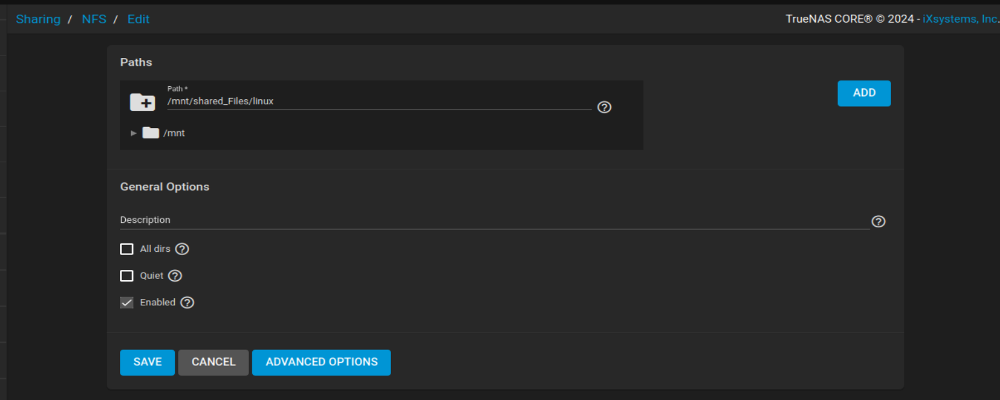

# LAB 1 : Home Network

# Home Network Setup with FreeNAS Server

## Background

You've been hired to set up a reliable home office network for a small business. The client requires a secure and efficient network infrastructure that supports both Windows and Linux environments, along with centralized storage capabilities through a NAS server.

## Business Requirements

- Secure internet connectivity for all devices
- Centralized file storage and sharing capabilities
- Support for multiple client operating systems
- Reliable network segmentation
- Automated IP address management

## Technical Requirements

1. **Network Infrastructure**:
    - 1 Cisco Router for WAN and LAN connectivity
    - 2 Layer 2 Switches for network segmentation
    - Cloud connection for internet access
2. **Client Devices**:
    - 2 Windows 10 workstations
    - 1 Linux Mint workstation
    - 1 FreeNAS server for centralized storage
    - Additional PC for testing
3. **Network Services**:
    - DHCP for automatic IP assignment
    - NAT for internet access
    - File sharing protocols (SMB/CIFS and NFS)

## Network Topology


## Topology Details

- **WAN Connection**: Router connected to Cloud via interface enxfa562a999f7
- **Internal Networks**:
    - Network 1 (192.168.1.0/24): Windows clients
    - Network 2 (192.168.2.0/24): Linux and NAS systems
- **Switch Connections**:
    - Switch1: Connected to Router g1/0, serves Windows clients
    - Switch2: Connected to Router g2/0, serves Linux and NAS

## IP Addressing Scheme

| Device | Interface | IP Address | Subnet Mask | Gateway | DHCP/Static |
| --- | --- | --- | --- | --- | --- |
| Router WAN | enxfa562a999f7 | 192.168.110.1 | 255.255.255.0 | ISP Assigned | Static |
| Router LAN1 | g1/0 | 192.168.1.1 | 255.255.255.0 | N/A | Static |
| Router LAN2 | g2/0 | 192.168.2.1 | 255.255.255.0 | N/A | Static |
| PC1 | e0 | 192.168.1.10 | 255.255.255.0 | 192.168.1.1 | DHCP |
| Windows10-1 | e0 | 192.168.1.11 | 255.255.255.0 | 192.168.1.1 | DHCP |
| Windows102-1 | e0 | 192.168.1.12 | 255.255.255.0 | 192.168.1.1 | DHCP |
| LinuxMint-1 | e0 | 192.168.2.12 | 255.255.255.0 | 192.168.2.1 | DHCP |
| FreeNAS-1 | e0 | 192.168.2.50 | 255.255.255.0 | 192.168.2.1 | Static |

## Detailed Implementation Guide

### 1. Router Configuration

```
! Initial Router Setup
enable
configure terminal

! Set hostname and security
hostname R1
enable secret YourEnableSecret
banner motd # Unauthorized access is prohibited! #

! WAN Interface Configuration
interface GigabitEthernet0/0
 ip address 192.168.110.1 255.255.255.0
 no shutdown

! LAN1 Interface Configuration (Windows Network)
interface GigabitEthernet1/0
 ip address 192.168.1.1 255.255.255.0
 no shutdown

! LAN2 Interface Configuration (Linux/NAS Network)
interface GigabitEthernet2/0
 ip address 192.168.2.1 255.255.255.0
 no shutdown

! Enable IP routing
ip routing

! DHCP Configuration for Windows Network
ip dhcp excluded-address 192.168.1.1 192.168.1.9
ip dhcp pool WINDOWS_POOL
 network 192.168.1.0 255.255.255.0
 default-router 192.168.1.1
 dns-server 8.8.8.8
 lease 7

! DHCP Configuration for Linux Network
ip dhcp excluded-address 192.168.2.1 192.168.2.9
ip dhcp excluded-address 192.168.2.50
ip dhcp pool LINUX_POOL
 network 192.168.2.0 255.255.255.0
 default-router 192.168.2.1
 dns-server 8.8.8.8
 lease 7

! NAT Configuration
ip access-list standard NAT-ACL
 permit 192.168.1.0 0.0.0.255
 permit 192.168.2.0 0.0.0.255

interface GigabitEthernet0/0
 ip nat outside

interface GigabitEthernet1/0
 ip nat inside

interface GigabitEthernet2/0
 ip nat inside

ip nat inside source list NAT-ACL interface GigabitEthernet0/0 overload

! Save configuration
do write memory

```

### 2. Switch Configuration

### Switch 1 (Windows Network)

```
enable
configure terminal

! Basic setup
hostname S1
enable secret YourEnableSecret

! Configure interfaces
interface range fa0/1 - 24
 description "Access Ports for Windows Clients"
 switchport mode access
 no shutdown

! Save configuration
do write memory

```

### Switch 2 (Linux/NAS Network)

```
enable
configure terminal

! Basic setup
hostname S2
enable secret YourEnableSecret

! Configure interfaces
interface range fa0/1 - 24
 description "Access Ports for Linux and NAS"
 switchport mode access
 no shutdown

! Save configuration
do write memory

```

Let's break down the steps for configuring the NAS server in your lab setup. If you're using GNS3 and a VM running FreeNAS (or TrueNAS), you’ll be able to set this up virtually.

### NAS Server Configuration

### 1. **Install FreeNAS (TrueNAS)**

- **Virtualization Environment**:
    - If you're using GNS3, you'll need to import the FreeNAS or TrueNAS ISO file as a virtual machine.
    - Create a new VM in GNS3 for the NAS server and allocate it enough CPU, memory, and storage for testing.
    
    
    
- **Installation Process**:
    - Boot the VM using the FreeNAS/TrueNAS ISO file.
    - Follow the installation steps, and when prompted, assign a static IP address during the initial setup:
        - **IP Address**: `192.168.2.50/24`
        - **Subnet Mask**: `255.255.255.0`
        - **Gateway**: `192.168.2.1` (the IP address of the router)
        
        
        

### 2. **Network Configuration**

- **Access the NAS Web Interface**:
    - Once FreeNAS (or TrueNAS) is installed and running, access the web interface from a client browser by entering `http://192.168.2.50`.
    - Login with the default admin credentials and change the password after the first login.
    
    
    
- **Set Gateway**:
    - If you didn’t set the gateway during installation, you can configure it in the FreeNAS web interface:
        - Go to **Network** → **Global Configuration**.
        - Set the **Default Gateway** to `192.168.2.1`.

### 3. **File Sharing Setup**

- **Create Shared Folders**:
    - In the FreeNAS web interface, create new datasets or shared folders:
        - Go to **Storage** → **Pools** → Create a new pool or dataset for your shared storage.
        - Name your datasets as per your needs (e.g., `backups`, `shared_files`).
        
        
        
- **Enable SMB/CIFS for Windows PCs**:
    - Go to **Services** → Enable **SMB** (Server Message Block).
    - Configure SMB by setting up a share:
        - Go to **Sharing** → **Windows (SMB) Shares** → **Add**.
        - Select the dataset you created for the share and configure the share permissions.
    - You can add users for access control under **Accounts** → **Users**.
    
    
    
- **Enable NFS for Linux PCs**:
    - Go to **Services** → Enable **NFS** (Network File System).
    - Configure NFS by setting up an NFS share:
        - Go to **Sharing** → **UNIX (NFS) Shares** → **Add**.
        - Select the dataset for the NFS share and specify which clients (IP ranges or individual IPs) can access the share.
    - Ensure that the necessary permissions are set under **Permissions** for the share.
    
    
    

### 4. **Access from Client Devices**

- **Windows Clients (SMB)**:
    - On a Windows PC, open **File Explorer** and in the address bar, type:
        
        ```
        \\\\192.168.2.50
        
        ```
        
    - You should see the SMB shares and be prompted for credentials if access is restricted.
    
    
    
- **Linux Clients (NFS)**:
    - On a Linux machine, you can mount the NFS share using the following command:
        
        ```bash
        sudo mount -t nfs 192.168.2.50:/mnt/dataset /mount/point
        
        ```
        
    - Make sure the `/mount/point` directory exists before mounting.


## Testing and Verification

### 1. Network Connectivity Tests

```bash
# From Windows PCs (192.168.1.x):
ping 192.168.1.1    # Router LAN1
ping 192.168.2.1    # Router LAN2
ping 192.168.2.50   # NAS Server
ping 8.8.8.8        # Internet

# From Linux PC (192.168.2.x):
ping 192.168.2.1    # Router LAN2
ping 192.168.2.50   # NAS Server
ping 192.168.1.1    # Router LAN1
ping 8.8.8.8        # Internet

```

### 2. File Sharing Tests

### Windows Access

```powershell
# Map network drive
net use Z: \\\\192.168.2.50\\windows_share

```


### Linux Access

```bash
# Mount NFS share
sudo mount -t nfs 192.168.2.50:/mnt/storage/linux_share /mnt/nas

```


## Troubleshooting Guide

### Common Issues and Solutions

1. **No DHCP Address Received**
    - Verify router DHCP configuration
    - Check switch port status
    - Confirm client network adapter settings
2. **Cannot Access NAS**
    - Verify IP configuration
    - Check network connectivity
    - Confirm share permissions
3. **No Internet Access**
    - Verify NAT configuration
    - Check default gateway settings
    - Confirm DNS settings

### Verification Commands

```
! Router Commands
show ip interface brief
show ip dhcp binding
show ip nat translations
show running-config

! Switch Commands
show interfaces status
show mac address-table

```

### The Final Diagram (GNS3)

## 


## Conclusion

This network implementation provides a secure and efficient environment for the small business, with proper segmentation between Windows and Linux networks, centralized storage, and reliable internet connectivity. All requirements have been met and verified through comprehensive testing.
